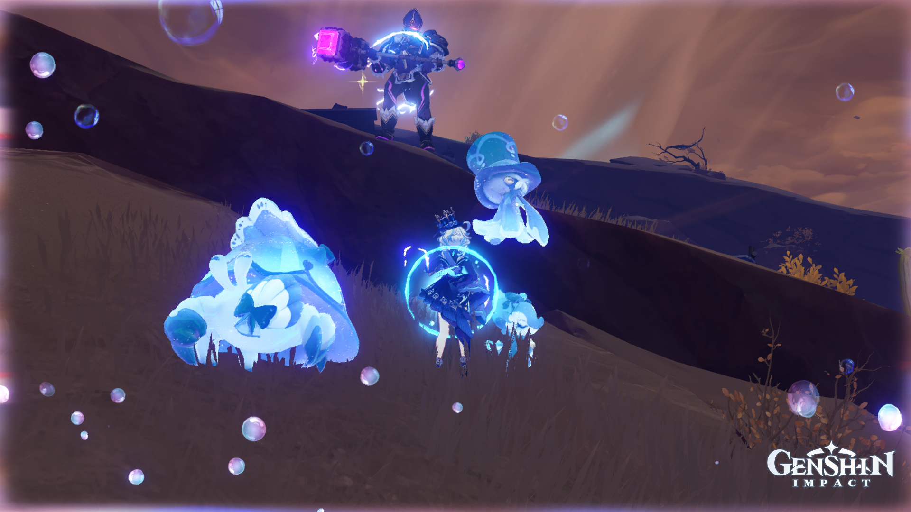
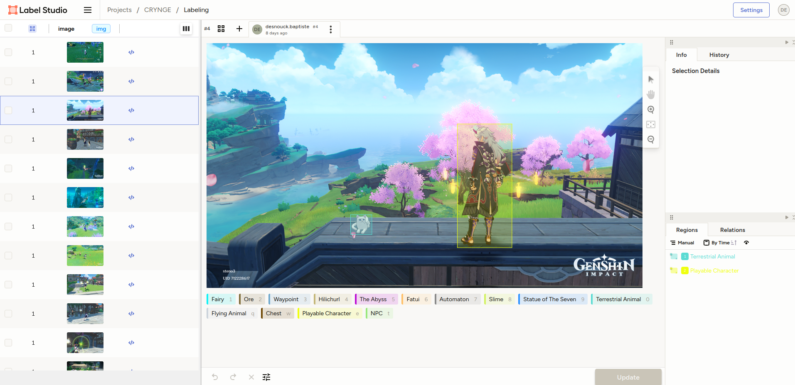

# How We Constitute the Database

## Source Images

To build our dataset, we gathered images from two primary sources: screenshots from our own gameplay and images sourced from the internet. To enhance the variety, we also utilized the in-game camera functionality, which allowed us to capture focused images of objects/characters, providing a more diverse dataset.

Below are examples of the types of images included in our dataset:

    <figure style="text-align: center;">
        
        <figcaption>Photo from our own gameplay</figcaption>
    </figure>
    <figure style="text-align: center;">
        
        <figcaption>Image sourced from the internet</figcaption>
    </figure>

## How We Label Them

To label the images, we used a free open-source software called Label Studio, which is deployed on one of our personal servers. This setup allows us to collaboratively label the images. Considering that training involves downscaling image resolution, we chose not to label small objects in screenshots, as they would become irrelevant at lower resolutions (For photos, this issue is less common since the images are more focused). Once the images are labeled, we export them in the YOLO format.

    
    
Example of Label Studio interface used for labeling

## How to Separate the Database into Training, Validation, and Test Datasets

To ensure proper training and evaluation of our model, we split the dataset into three subsets:

1. **Training Set**: 75% of the total dataset is used to train the model
2. **Validation Set**: 15% of the dataset is used to tune hyperparameters and prevent overfitting.
3. **Test Set**: 10% of the dataset is used to evaluate the final performance of the model.

The splitting is done randomly while ensuring that the distribution of classes remains consistent across all subsets.
