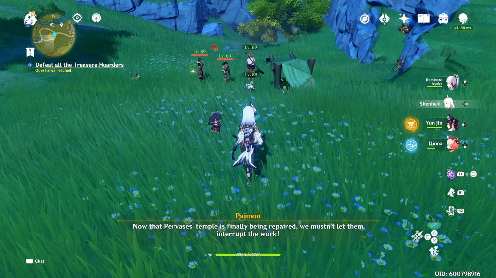

# Genshin-YOLO-Detection (also known as CRYNGE - Computer Recognition using YOLO for Notable Genshin Elements)

This project implements a YOLO-based environmental detection model for Genshin Impact. The goal is to detect the most important elements visible while playing the popular game Genshin Impact, especially during open-world exploration. The potential uses for this project can be an accessibility plugin to provide commentary on screen activity or, for less ethical purposes, a cheat to automate farming in the game.


Thus, we've selected several key classes to detect:
1. 🧚 **Fairies** - Fairies that guide players to treasures.
2. 🗝️ **Chests** - Treasure chests scattered across the map.
3. 🪓 **Hilichurls** - Hilichurls, one of the most common enemies.
4. 🌌 **The Abyss** - Abyss-related enemies.
5. 😈 **Fatui** - Members of the Fatui faction.
6. 🤖 **Automatons** - Ancient automatons and mechanical enemies.
7. 🟢 **Slimes** - Slimes of various elemental types.
8. 🧑‍🤝‍🧑 **Playable Characters** - Characters that are part of the player's roster.
9. 🗣️ **NPCs** - Non-playable characters
10. ⛏️ **Ores** - Mineable ores for crafting and upgrades.
11. 📍 **Waypoints** - Teleport waypoints for fast travel.
12. 🗿 **Statues of The Seven** - Statues used for healing, map unlocking, and fast travel.
13. 🐾 **Terrestrial Animals** - Animals roaming the land.
14. 🕊️ **Flying Animals** - Birds and other flying creatures.

To learn more about how we construct our dataset, refer to the [Dataset Preparation](DATASET_PREPARATION.md).

## What to expect ?

This object detection project is quite complicated as we have numerous classes with not enough images for each (Yes, we wanted to complicate our lives by choosing these classes). That's why we decided to include as many images as possible in the database while trying to maintain relatively balanced classes.

Nevertheless, the classes will be unbalanced anyway as there will be more Playable Characters due to gameplay screens as you can see below.

<figure style="text-align: center;">
        
            <figcaption>Gameplay screen</figcaption>
</figure>

Moreover, the playable character is almost always in the middle of the screen and there are also other classes in the minority.

In brief, our biggest challenges here are to correct or at least mitigate these biases:
* Playable Characters almost always in the middle
* Unbalanced classes

By addressing these issues, we hope to create a modest model that will detect not only playable characters but also the other classes.

## Project Structure

```
Genshin-YOLO-Detection/
│
├── training_notebook.ipynb # Jupyter notebook used for training the YOLO model (in Google Colab)
├── /illustration-images    # Contains images used to illustrate the project
├── /dataset                # Directory containing the training dataset (and validation)
├── DATASET_PREPARATION.md  # Documentation on how the dataset was prepared
└── README.md               # Project documentation (this file)
```

## Contributors

- [Nino Rottier](https://github.com/steno3)
- [Baptiste Desnouck](https://github.com/baptdes)
- [Marwa El Omari](https://github.com/marwa-elomari)
- [Théo Corsetti]()

## Acknowledgments
- [OiseauDesNuages](https://github.com/OiseauDesNuages) for contributing images to our dataset

- [YOLOv11 by Ultralytics](https://github.com/ultralytics/ultralytics)
- [LabelStudio](https://labelstud.io/)