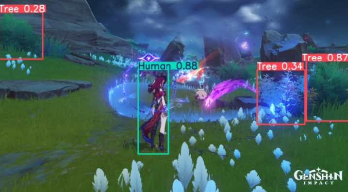

# Genshin-YOLO-Detection (also known as CRYNGE - Computer Recognition using YOLO for Notable Genshin Elements)

This project implements a YOLO-based environmental detection model for Genshin Impact. The goal is to detect the most important elements visible while playing the popular game Genshin Impact, especially during open-world exploration. The potential uses for this project can be an accessibility plugin to provide commentary on screen activity or, for less ethical purposes, a cheat to automate farming in the game.



Thus, we've selected several key classes to detect:
- 🌳 Trees  
- 🧚 Fairies  
- 🗝️ Chests  
- 👹 Monsters  
- 🧑‍🤝‍🧑 Humans 
- ⛏️ Ores  
- 📍 Waypoints  
- 🐾 Terrestrial animals  
- 🕊️ Flying animals

## Project Structure

```
Genshin-YOLO-Detection/
│
├── training_notebook.py    # Python notebook used for training the YOLO model (in Google Colab)
├── /illustration-images    # Contains images used to illustrate the project
├── /dataset                # Directory containing the training dataset (and validation)
└── README.md               # Project documentation (this file)
```

## Contributors

- steno3 (Nino Rottier)
- baptdes (Baptiste Desnouck)
- Marwa El Omari
- Théo Corsetti