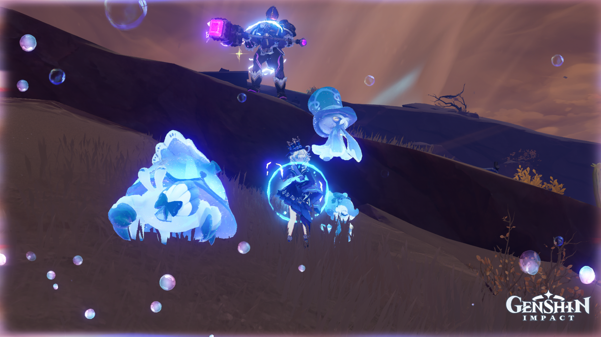

# Data Set Constitution Report

ENSEEIHT - 2025

## Project Overview
This report details the creation and organization of a dataset for the Genshin-YOLO-Detection project.

## Project Team
- [Nino Rottier](https://github.com/steno3)
- [Baptiste Desnouck](https://github.com/baptdes)
- [Marwa El Omari](https://github.com/marwa-elomari)
- [Théo Corsetti](https://github.com/theocorsetti)

## Repository Access
All code, datasets, and documentation (including this report) are available in our [GitHub repository](https://github.com/baptdes/Genshin-YOLO-Detection).

# Genshin-YOLO-Detection (also known as CRYNGE - Computer Recognition using YOLO for Notable Genshin Elements)

This project implements a YOLO-based environmental detection model for Genshin Impact. The goal is to detect the most important elements visible while playing the popular game Genshin Impact, especially during open-world exploration. The potential uses for this project can be an accessibility plugin to provide commentary on screen activity or, for less ethical purposes, a cheat to automate farming in the game.

<figure style="text-align: center;">
        
            <figcaption>Detection example done with other classes</figcaption>
</figure>

Thus, we've selected several key classes to detect:
1. 🧚 **Fairies** - Fairies that guide players to treasures.
2. 🗝️ **Chests** - Treasure chests scattered across the map.
3. 🪓 **Hilichurls** - Hilichurls, one of the most common enemies.
4. 🌌 **The Abyss** - Abyss-related enemies.
5. 😈 **Fatui** - Members of the Fatui faction.
6. 🤖 **Automatons** - Ancient automatons and mechanical enemies.
7. 🟢 **Slimes** - Slimes of various elemental types.
8. 🧑‍🤝‍🧑 **Playable Characters** - Characters that are part of the player's roster.
9. 🗣️ **NPCs** - Non-playable characters
10. ⛏️ **Ores** - Mineable ores for crafting and upgrades.
11. 📍 **Waypoints** - Teleport waypoints for fast travel.
12. 🗿 **Statues of The Seven** - Statues used for healing, map unlocking, and fast travel.
13. 🐾 **Terrestrial Animals** - Animals roaming the land.
14. 🕊️ **Flying Animals** - Birds and other flying creatures.

## What to expect ?

This object detection project is quite complicated as we have numerous classes with not enough images for each (Yes, we wanted to complicate our lives by choosing these classes). That's why we decided to include as many images as possible in the database while trying to maintain relatively balanced classes.

Nevertheless, the classes will be unbalanced anyway as there will be more Playable Characters due to gameplay screens as you can see below.

<figure style="text-align: center;">
        
            <figcaption>Gameplay screen</figcaption>
</figure>

Moreover, the playable character is almost always in the middle of the screen and there are also other classes in the minority.

In brief, our biggest challenges here are to correct or at least mitigate these biases:
* Playable Characters almost always in the middle
* Unbalanced classes

By addressing these issues, we hope to create a modest model that will detect not only playable characters but also the other classes.

# How We Constitute the Database

## Source Images

To build our dataset, we gathered images from two primary sources: screenshots from our own gameplay and images sourced from the internet. To enhance the variety, we also utilized the in-game camera functionality, which allowed us to capture focused images of objects/characters, providing a more diverse dataset.

Below are examples of the types of images included in our dataset:

<div style="display: flex; justify-content: space-around; align-items: center;">
    <figure style="text-align: center;">
        
        <figcaption>Photo from our own gameplay</figcaption>
    </figure>
    <figure style="text-align: center;">
        
        <figcaption>Image sourced from the internet</figcaption>
    </figure>
</div>

## How We Label Them

To label the images, we used a free open-source software called Label Studio, which is deployed on one of our personal servers. This setup allows us to collaboratively label the images. Once the images are labeled, we export them in the YOLO format.

<div style="text-align: center;">
    
    <p>Example of Label Studio interface used for labeling</p>
</div>

## How to Separate the Database into Training, Validation, and Test Datasets

To ensure proper training and evaluation of our model, we split the dataset into three subsets:

1. **Training Set**: 75% of the total dataset is used to train the model
2. **Validation Set**: 15% of the dataset is used to tune hyperparameters and prevent overfitting.
3. **Test Set**: 10% of the dataset is used to evaluate the final performance of the model.

The splitting is done randomly for now. But, as we have unbalanced class, we may try to split the dataset smartly to ensure that the distribution of classes remains consistent across all subsets. One solution that can be implemented is a stratified split based on this [article](https://jaidevd.com/posts/obj-detection-stratification/). Another solution would be to use K-Fold Cross Validation, but it would significantly increase the training time.

### Code to import and split the DataBase

The script to import the database into Google Colab :

```python
!rm -rf dataset
!git clone https://github.com/baptdes/Genshin-YOLO-Detection.git
!mv Genshin-YOLO-Detection/dataset dataset
!rm -rf Genshin-YOLO-Detection

DATASET_PATH = '/content/dataset'
DATA_PATH = '/content/data.yaml'
```

The script to split the data : 

```python
# ============================ Random Split ==================================
validation_size = 0.15
test_size = 0.10


train_files, temp_files = train_test_split(
    labels_df.index, test_size= validation_size + test_size, random_state=42
)

test_size = test_size / (validation_size + test_size)
val_files, test_files = train_test_split(
    temp_files, test_size=test_size, random_state=42
)

# ======================= Create output folder =============================
output_path = Path("split_dataset")
for split in ["train", "val", "test"]:
    (output_path / split / "images").mkdir(parents=True, exist_ok=True)
    (output_path / split / "labels").mkdir(parents=True, exist_ok=True)

def move_files(files, split):
    for file in files:
        src_img = dataset_path / f"images/{file}.png"
        src_lbl = dataset_path / f"labels/{file}.txt"

        dst_img = output_path / split / "images" / f"{file}.png"
        dst_lbl = output_path / split / "labels" / f"{file}.txt"

        if src_img.exists():
            shutil.copy(src_img, dst_img)
        if src_lbl.exists():
            shutil.copy(src_lbl, dst_lbl)

move_files(train_files, "train")
move_files(val_files, "val")
move_files(test_files, "test")

# ======================= Create data_split.yaml =============================
yaml_content = {
    "train": str(output_path / "train"),
    "val": str(output_path / "val"),
    "test": str(output_path / "test"),
    "nc": len(classes),
    "names": classes,
}

with open(output_path / "data_split.yaml", "w") as f:
    yaml.dump(yaml_content, f)

print("Dataset successfully split into train, val, and test with stratified distribution.")
```

This split is accompanied by feature vectors to see how the class distribution evolves. You can learn more about that in the training notebook (`training_notebook.ipynb`) on the [Github repository](https://github.com/baptdes/Genshin-YOLO-Detection).


## Acknowledgments
- [OiseauDesNuages](https://github.com/OiseauDesNuages) for contributing images to our dataset